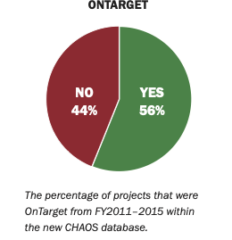
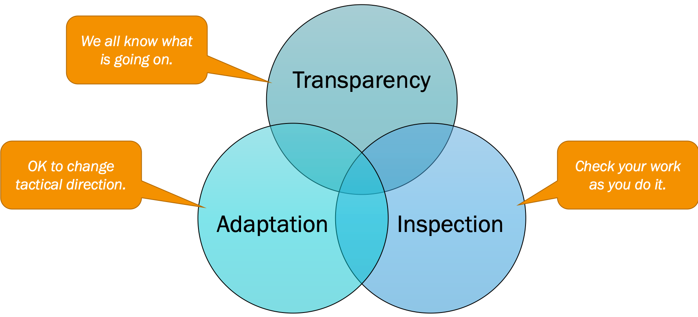

<!-- _paginate: false -->

# Agile

### [/ˈæd͡ʒ.aɪl/]

Arbeitsweise für moderne Softwareentwicklung

<!-- This is presenter note. You can write down notes through HTML comment. -->

---

### Warum eigentlich Agile?

<!-- wer hat schonmal was gehört? -->
<!-- klassische projekte/methoden -->
<!-- vorstellbare probleme? -->

---

<!-- CHAOS report von standish group -->
<!-- 5 jahre mit insgesamt >25k projekten -->
<!-- https://standishgroup.com/sample_research_files/CHAOSReport2015-Final.pdf -->

---

<!-- weder on budget -->

---

<!-- noch on time -->

---

<!-- oder zum richtigen thema -->

---

## Ist die Arbeit wertvoll?

Geplant !== Gebraucht

<!-- oft echt ungleich -->
<!-- klassisch langer vorlauf -->
<!-- projekt umfasst das ganze produkt mit allen features -->

---

---

## Agiles Manifest

https://agilemanifesto.org

<!-- relevante branchenleute -->
<!-- 2001 -->

---

### Lasten- und Pflichtenhefte

<!-- last: komplette feature anforderung -->
<!-- pflicht: detailliertes angebot der umsetzung -->
<!-- statisch / wasserfall -->

---

# MVP

Minimum Viable Product

<!-- früh am markt, ausprobieren, evaluieren. -->
<!-- man hat vermutungen *assumptions* getroffen -->
<!-- können zutreffen, müssen aber nicht -->
<!-- time and material -->

---

<!-- https://www.scrum.org/resources/blog/three-pillars-empiricism-scrum
 -->

---

### MVP - Focus

- Reduce complexity
- What is important?

---

### MVP - Validation

- First iteration of the app idea
- Quick feedback

---

### MVP - Completeness

- The app is now usable and _could be final_
- No additional work prepared
- No placeholders or dangling features

---

Vision → Epics → User Stories → Increment

<!-- vision: gemeinsame produktvision / gemeinsames ziel -->
<!-- epic: grobe idee eines features -->
<!-- story: customer journey -->
<!-- increment: auslieferbares ding -->

---

### User Stories

- User Stories are for everyone
- Focus on user needs
- Takes on user perspective
- Should never be 'because we can'

---

### User Story - Structure

- Value Proposition
- Description
- Acceptance Criteria
- Tasks
- Complexity

<!-- team decides on look -->

---

### User Story - Value Proposition

**As a** ...  
**I want to** ...  
**so that** ...

<!-- should be non technical -->
<!-- role is persona -->
<!-- goal to achieve -->
<!-- way to achieve goal -->

---

### User Story - Description

- Visual or structured Description
- Wireframes

<!-- mix of business and technical description -->

---

### User Story - Acceptance Criteria

- What needs to be finished
- How does the feature work exactly
- Quality gates

---

### User Story - Tasks

- The todos that were identified by the team
- Can be as technical and detailed as needed

<!-- is usually empty -->

---

### User Story - Complexity

- Relative estimation of work _complexity_
- is only comparable within a team
- changes with experience and team constellation

---

### Definition of Ready

###

### Definition of Done

<!-- Ready to work on -->
<!-- Ready to deliver -->

---

<!-- https://jimchristie.me/blog/scrum-graphic/ -->

---

<!-- team muss werte teilen -->
<!-- nicht zu großes team, nicht zu klein -->
<!-- enabled -->
<!-- cross functional -->

<!-- https://www.scrum.org/resources/blog/5-scrum-values-take-center-stage -->

---

## Conway's Law

> Any organization that designs a system (defined broadly) will produce a design whose structure is a copy of the organization's communication structure.
> _— Melvin E. Conway_
